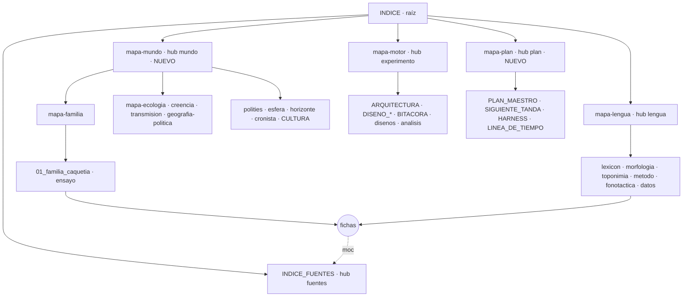

# Reorganización del vault — 2026-10-08

> **Cómo se midió.** Todo número de este documento sale de correr, hoy, sobre
> el árbol versionado en `b68bea5` (302 notas `.md`; no cuenta las cuatro
> `4-fuentes/sesiones/08_creencia_*` que otra sesión commiteó en `bc8ac33`
> mientras se medía): `check_vault_links.py`, `export_wiki_seed.py --dry-run`,
> `export_fichas_seed.py --dry-run`, `git log` sobre los hubs, `gh issue list`
> y cuatro scripts de auditoría (`medir_vault.py`, `analizar.py`,
> `escenarios.py`, `simular_objetivo.py`, todos con `python -I`) que hoy viven en
> el scratchpad de la sesión. **El PR 1 sube el medidor a
> `6-fusion/scripts/medir_grafo_vault.py`**: una cifra que no sale de un script
> del repo no se puede repetir (trampa de `CLAUDE.md`).
>
> El grafo se mide **como lo pinta Obsidian** con la configuración local de
> Miguel (`.obsidian/graph.json`, leída, no tocada): las notas `.md` son nodos;
> wikilinks (con alias y `#anclas`) y enlaces markdown internos son aristas;
> sin filtro, con huérfanas visibles y con los enlaces sin resolver pintados.
> Obsidian no indexa `.yaml`, `.py` ni `.txt` (no está activado *Detect all file
> extensions*) y los PDF son adjuntos ocultos (`showAttachments: false`).
> **No copiar cifras de aquí a otro sitio.**

## 0. Lo primero que hay que saber

- **El grafo no está roto: está sin capas.** El guardián da 0 enlaces rotos
  sobre 1.793 wikilinks. Lo que sobrecarga la vista son cuatro cosas medibles:
  (1) las 113 fichas de fuente reciben el 63 % de las aristas y se citan entre
  sí 373 veces; (2) `TABLERO.md`, generado, las enlaza a las 113 de golpe;
  (3) 92 notas sueltas —80 son borradores o issues publicados— que Obsidian
  pinta como polvo alrededor; (4) los hubs se dejaron de mantener cuando el
  vault tenía 88 notas, y hoy tiene 302.
- **No hacen falta mudanzas.** Más de una docena de scripts, un hook y tres
  puntos de la web leen rutas fijas (§5). La arquitectura se consigue con
  filtros del grafo (config local), dos hubs nuevos, una propiedad `moc:` que
  hace de padre, y una carpeta `_archivo/` para cuatro notas cuya ruta no usa
  ningún código.
- **Hay diez sí/no para Miguel (§6).** El paso 0 —pegar la configuración del
  grafo— no toca el repo y se puede probar hoy: la vista pasa de 315 puntos en
  93 piezas a 152 puntos en dos (una de 150). Con los PR 1-4, una sola pieza.

---

## 1. Diagnóstico

### 1.1 Inventario por carpeta

| Carpeta | Notas | KB | Con frontmatter | Generadas o con bloque generado |
|---|---|---|---|---|
| (raíz) | 3 | 96 | 2 | 1 — `TABLERO.md` |
| `1-plan/` | 9 | 120 | 8 | 1 — `CRONICA.md` |
| `2-lengua/` | 7 | 144 | 7 | 2 con bloque — `lexicon.md` (4 bloques de `tabla_lexicon.py`), `morfologia.md` (tabla de `tabla_morfemas.py`) |
| `3-mundo/` | 10 | 84 | 10 | 0 |
| `3-mundo/corpus/` | 2 | 22 | 0 | 0 |
| `3-mundo/ensayos/` | 5 | 161 | 5 | 0 |
| `4-fuentes/` | 114 | 1.074 | 114 | 1 con bloque — `medina-colina-sxx.md` (ancla de `aplicar_medina.py`) |
| `4-fuentes/sesiones/**` | 15 | 311 | 10 | 0 |
| `5-experimento/` | 10 | 234 | 6 | 0 |
| `5-experimento/analisis/` | 6 | 81 | 5 | 0 |
| `5-experimento/disenos/` | 6 | 63 | 3 | 0 |
| `5-experimento/series/` | 1 | 1 | 1 | 0 |
| `6-fusion/` (raíz) | 4 | 241 | 3 | 2 — `BANDEJA.md`, `TOPONIMOS_POR_FUENTE.md` |
| `6-fusion/fichas_propuestas/` | 6 | 25 | 6 | 0 |
| `6-fusion/fusionados/` | 1 | 1 | 0 | 0 |
| `6-fusion/issues-pendientes/` | 60 | 777 | 2 | 0 |
| `6-fusion/issues-pendientes/publicados/` | 39 | 255 | 0 | 0 |
| `curiana_sim/` | 3 | 55 | 0 | 0 |
| `fuentes_caquetios/` | 1 | 1 | 0 | 0 |
| **total** | **302** | **3.746** | **182** | **4 enteras + 3 con bloque** |

Fuera de las notas, el vault guarda 618 archivos más que Obsidian no dibuja:
257 `.py`, 187 `.yaml`, 74 `.pdf`, 64 `.txt`, 15 `.json`, 13 `.sql`. El
guardián indexa 884 (añade `.yaml`, `.py`, `.txt` y `.pdf` como destinos
enlazables); Obsidian, sólo las 302 notas y los PDF.

**Cómo creció** (notas `.md` versionadas en `main`, por fecha):

| 2026-07-30 | 2026-08-09 | 2026-09-01 | 2026-09-15 | 2026-10-01 | hoy (`b68bea5`) |
|---|---|---|---|---|---|
| 28 | 88 | 148 | 179 | 294 | 302 |

Último commit que tocó cada hub: los seis `mapa-*` el **2026-08-06**,
`INDICE.md` el **2026-08-09**, `INDICE_FUENTES.md` el **2026-08-25**. Desde que
se dejó de mantener el índice, el vault se multiplicó por 3,4.

### 1.2 Por capa: qué es cada nota

| Capa | Dónde | Notas | KB | Sin entradas | Sin salidas | Sueltas |
|---|---|---|---|---|---|---|
| ficha de fuente | `4-fuentes/*.md` | 113 | 1.053 | 0 | 14 | 0 |
| borrador de issue | `6-fusion/issues-pendientes/*.md` | 60 | 777 | 55 | 49 | 46 |
| issue publicado | `…/publicados/*.md` | 39 | 255 | 39 | 34 | 34 |
| hoja de sesión o de minería | `4-fuentes/sesiones/**` | 15 | 311 | 4 | 4 | 4 |
| trabajo de fusión | resto de `6-fusion/**/*.md` | 11 | 267 | 10 | 3 | 2 |
| canon del experimento | `5-experimento/*.md` | 9 | 229 | 0 | 2 | 0 |
| hub o MOC | `mapa-*`, `INDICE_FUENTES` | 8 | 53 | 0 | 0 | 0 |
| canon del mundo | `3-mundo/*.md`, `corpus/*.md` | 7 | 83 | 0 | 2 | 0 |
| análisis de runs | `5-experimento/analisis/`, `series/` | 7 | 82 | 3 | 2 | 1 |
| canon de lengua | `2-lengua/*.md` | 6 | 140 | 0 | 0 | 0 |
| diseño | `5-experimento/disenos/` | 6 | 63 | 1 | 2 | 0 |
| ensayo | `3-mundo/ensayos/` | 5 | 161 | 0 | 0 | 0 |
| plan vivo | `PLAN_MAESTRO`, `SIGUIENTE_TANDA`, `HARNESS`, `LINEA_DE_TIEMPO` | 4 | 59 | 0 | 0 | 0 |
| registro de plan | `HANDOFF_*`, `REVISION_*`, `F10_muestreo_*` | 4 | 37 | 2 | 1 | 1 |
| doc de código | `curiana_sim/*.md`, `fuentes_caquetios/**` | 4 | 56 | 4 | 4 | 4 |
| raíz | `INDICE`, `TABLERO`, `CLAUDE` | 3 | 96 | 0 | 1 | 0 |
| plan generado | `CRONICA` | 1 | 23 | 0 | 0 | 0 |
| **total** | | **302** | **3.746** | **118** | **118** | **92** |

En tres bloques: **canon y hubs, 53 notas (23 % de los bytes)**; **fichas, 113
(28 %)**; **trabajo, cola, generados y docs de código, 136 (48 %)**.

Los 60 borradores son cola real: ninguno coincide en título con los 63 issues
que hay en GitHub (similitud máxima 0,54). No hay borradores publicados sin
archivar; hay 60 sin publicar.

### 1.3 El grafo tal como lo pinta Obsidian hoy

Configuración local: `showOrphans: true`, `hideUnresolved: false`,
`showAttachments: false`, `search: ""`, `colorGroups: []`.

| Medida | Valor |
|---|---|
| Puntos en pantalla | **315** = 302 notas + 13 nodos fantasma |
| Enlaces escritos | 1.844 = 1.793 wikilinks + 51 enlaces markdown |
| Aristas distintas nota→nota | **1.234** (591 enlaces repiten un par ya enlazado; Obsidian dibuja uno) |
| Componentes | **93** = una pieza de 210 notas y **92 puntos sueltos** |
| Sin entradas (huérfanas) | 118 |
| Sin salidas (sumideros) | 118 |
| Nodos fantasma | 13 = 11 YAML (6 enlazados desde `corpus/README`, 4 desde las fichas y borradores de Oviedo y Pérez de Tolosa, y `bibliografia.yaml` con un wikilink desde `datos-de-lengua`) y 2 carpetas (`../3-mundo/`, `../4-fuentes/` en `PLAN_MAESTRO`) |
| Rotos según `check_vault_links.py` | 0 (resuelve contra `.yaml`/`.py`, que Obsidian no ve) |
| Sin entradas según el guardián | los 4 lotes de Esteves en `4-fuentes/sesiones/` |

Si se quitan `INDICE`, `TABLERO` y `CLAUDE`, las piezas pasan de 93 a 107: sólo
15 notas (13 sueltas y un par) dependen de la raíz para estar conectadas. El
grafo se sostiene por las fichas, no por los índices.

### 1.4 Qué la sobrecarga, en orden de peso

1. **Las fichas de fuente son el grafo.** 113 nodos (37 %) reciben 775 de las
   1.234 aristas (63 %). 97 de las 113 enlazan a otras fichas: **373 aristas
   ficha→ficha, el 30 % del total**. 11 de los 20 nodos con más entradas son
   fichas. Es una red de citas real —Arcaya cita a Oviedo, Jahn cita a Oviedo—
   y no hay que borrarla; pero sin un color que la separe, se come la vista.
2. **`TABLERO.md` es una estrella.** 123 aristas salientes (el 10 % del total):
   las 113 fichas a la vez. Para 21 fichas es la **única** entrada. Es
   generado: su tabla de fuentes enlaza cada obra.
3. **Polvo: 92 notas sueltas (30 % de los nodos).** 46 borradores, 34
   publicados, los 4 lotes de Esteves (113 KB de hojas de minería),
   4 docs de código, `TOPONIMOS_POR_FUENTE.md` (generado, 107 KB),
   `fusionados/README.md`, `F10_muestreo_2026-09-12.md` y un análisis que nadie
   enlaza (`era2_base_escena_competencia_y_director_2026-09-28.md`).
4. **13 fantasmas**, por enlazar datos con enlace markdown.
5. **Los hubs se quedaron atrás.** De 40 notas canon (lengua, mundo, ensayos,
   experimento, diseños, análisis), **22 no suben a ningún MOC y 19 no bajan
   de ninguno** (anexo B). Los ejes **mundo** y **plan** no tienen hub: los
   cinco mapas temáticos, `polities-caquetias`, `esfera-de-interaccion`,
   `horizonte-de-contacto`, `cronista` y `CULTURA_CAQUETIA` cuelgan
   directamente de `INDICE`. [[INDICE_FUENTES]] enlaza **31 de 113 fichas** y
   sólo 23 fichas suben a él. Si `TABLERO` se quita de la vista, **55 fichas
   no reciben ninguna entrada desde una nota canon y 13 se quedan sueltas**
   (anexo C).

**Lo que no la sobrecarga**, aunque lo pareciera:

- **No hay cientos de sesiones.** Hay 15 hojas de sesión y 4 registros de plan.
- **Los enlaces repetidos no se ven**: Obsidian dibuja una arista por par.
- **Los YAML, `.py` y PDF no salen**, salvo los 11 YAML que se enlazan con
  enlace markdown y se pintan como fantasmas.
- **Los índices apenas se pisan en enlaces**: el mayor solapamiento es
  `TABLERO` × `INDICE_FUENTES`, 33 destinos comunes (Jaccard 0,26). El
  duplicado es de **contenido** (§1.8), no de aristas.

### 1.5 Los hubs

**Los 20 con más entradas** (notas distintas que enlazan a cada una):

| # | Nota | Entran | Salen | Capa |
|---|---|---|---|---|
| 1 | `arcaya-1920` | 45 | 11 | ficha |
| 2 | `zavala-reyes-2015` | 44 | 11 | ficha |
| 3 | `INDICE_FUENTES` | 35 | 37 | hub |
| 4 | `jahn-1927` | 33 | 11 | ficha |
| 5 | `oliver-1989-cap3` | 30 | 14 | ficha |
| 6 | `alvarado-1921` | 26 | 5 | ficha |
| 7 | `oliver-1989-cap2` | 25 | 8 | ficha |
| 8 | `van-buurt-2014` | 24 | 6 | ficha |
| 9 | `gatschet-1885` | 19 | 6 | ficha |
| 10 | `las-casas-1875` | 19 | 3 | ficha |
| 11 | `esteves-1989` | 18 | 16 | ficha |
| 12 | `PLAN_MAESTRO` | 17 | 4 | plan |
| 13 | `CULTURA_CAQUETIA` | 16 | **0** | canon mundo |
| 14 | `polities-caquetias` | 16 | 12 | canon mundo |
| 15 | `oviedo-y-valdes-1851` | 16 | 10 | ficha |
| 16 | `DISENO_KOINE` | 16 | 1 | canon experimento |
| 17 | `02_protocolo_habla_paraguanera` | 16 | 1 | diseño |
| 18 | `mapa-motor` | 16 | 15 | hub |
| 19 | `esfera-de-interaccion` | 15 | 10 | canon mundo |
| 20 | `mapa-ecologia` | 15 | 12 | MOC |

**Los que más enlazan**: `TABLERO` 123 · `lexicon` 37 · `INDICE_FUENTES` 37 ·
`INDICE` 26 · `mapa-lengua` 21 · `morfologia` 21 · `corpus/README` 17 ·
`mapa-creencia` 17 · `mapa-familia` 16 · `esteves-1989` 16.

`CULTURA_CAQUETIA` —el canon narrativo— es un sumidero: 16 notas lo citan y él
no enlaza a nada. `SIGUIENTE_TANDA`, la nota de «empieza por aquí», recibe una
sola entrada (desde `INDICE`).

### 1.6 Frontmatter

- **182 de 302 notas lo tienen.** De las 120 sin él, 97 son borradores y
  publicados — y está bien: se publican tal cual con `--body-file` (§3.1).
- **`tipo`: 181 notas, 23 valores distintos**, entre ellos `diseño` y `diseno`
  para lo mismo y un valor libre de 49 caracteres («auditoría (propuesta,
  regla 5 — no fusiona nada)»). Dos borradores llevan `tipo` (`decision`,
  `issue-pendiente`): ese frontmatter llegaría a GitHub.
- **Las fichas tienen un esquema sano**: `tipo` 113/113, `estado_minado`
  113/113, `aliases` 112/113, `sostiene` 79/113, `cobertura` 68/113. Lo leen
  `generar_tablero.py`, `generar_bibliografia.py` y los exportadores. No se toca.
- **El esqueleto (53 notas canon y hubs) está a medias:**

| Clave | Notas que la tienen (de 53) | Observación |
|---|---|---|
| `tipo` | 41 | 11 sin frontmatter (`PLAN_MAESTRO`, `corpus/README`, `ecologia_lexicon_map`, `CANON_TIERRA`, `DISENO_KOINE`, `IDEA_PERFILES_AGENTES`, `MIGRACION_RUNS_EVOLUCION`, `ANALISIS_RUN_30T_2026-06-22`, los tres `disenos/02_*`) y `CULTURA_CAQUETIA` sin `tipo` |
| `pregunta` | 21 | el principio del vault es «cada carpeta responde una pregunta» |
| `fuentes` | 8 | dos significados: 7 listan fichas; 1 lista tablas de la base |
| `estado` | 8 | 5 `estado` + 3 `estatus`, en texto libre |
| `descripcion` | 15 | exactamente las 15 notas que publica la web — la escribe Miguel para un lector |
| `moc` | 5 | en **texto plano** (`moc: mapa-familia`): Obsidian no lo dibuja. Hay 14 en todo el vault (5 ensayos + 9 sesiones) |
| `medido` | 25 | fecha de las cifras (regla 1) |

- **Etiquetas: ninguna nota usa `tags`.** Cualquier filtro por etiqueta
  obligaría a etiquetar primero.

### 1.7 Nombres

| Patrón (se solapan) | Notas | Dónde |
|---|---|---|
| `kebab-case` | 233 | fichas (112 de 113), `mapa-*`, notas de lengua, borradores |
| fecha `AAAA-MM-DD` en el nombre | 65 | 51 borradores, 4 publicados, 4 de plan, 4 análisis, 2 de fusión |
| `snake_case` | 50 | ensayos, diseños, sesiones, análisis |
| `MAYÚSCULAS` | 36 | plan, motor (`ARQUITECTURA`, `DISENO_*`), raíz, generados |
| prefijo `NN_` | 26 | ensayos (5), diseños (6), sesiones (14), análisis (1) |

- **Los nombres son únicos** salvo `README.md` (6), y ninguno se enlaza como
  `[[README]]`: la regla de basename único se cumple, y es la que permite mover
  sin romper wikilinks.
- **El patrón por capa es coherente**: fichas `autor-año`, MOCs `mapa-<tema>`,
  series `NN_snake`, documentos vivos en mayúsculas, registros con fecha. Lo
  que se desvía es la cola: los prefijos de `fusionar-propuesta` §11
  (`issue-`, `decision-`, `comentario-<nº>-`, `fallo-`) los siguen 31 de 39
  publicados y **2 de 60 borradores**. Las cuatro hojas que entraron hoy
  mientras se medía (`08_creencia_achagua_que-minar` y sus tres hermanas,
  `bc8ac33`) mezclan `snake` y `kebab` en el mismo nombre, y el guardián ya
  lista dos de ellas como «sin enlaces entrantes»: el patrón se repite solo
  si nada lo encauza.

### 1.8 Índices que se repiten y cifras a mano

Hay **unas 17 notas de navegación para 302 notas**: `INDICE`, `TABLERO`,
`CLAUDE` («Dónde está cada cosa»), `INDICE_FUENTES`, `BANDEJA`, `CRONICA`, siete
`mapa-*`, `corpus/README`, `datos-de-lengua`, `SIGUIENTE_TANDA`,
`publicados/README` y `07_rastreo…/00-indice-y-pendientes`.

- **El mapa de carpetas está escrito tres veces**: `INDICE` «El territorio»,
  `CLAUDE.md` «Dónde está cada cosa» y la tabla «Índice» de `corpus/README`; y
  la tabla «Piezas» de cada MOC repite la de `corpus/README`. `INDICE` habla de
  «cinco carpetas» y no nombra `6-fusion/`; su árbol pone `supabase/` en la
  raíz del vault, donde no está.
- **Las fuentes tienen dos índices**: `INDICE_FUENTES` (a mano, 31 de 113
  fichas, último cambio el 2026-08-25) y `TABLERO` §2 (generado, 113 de 113).
- **`INDICE.md` lleva 20 cifras a mano y 17 están desfasadas** contra
  [[TABLERO]] (regla 1):

| En `INDICE.md` | Dice | `TABLERO.md` (2026-10-05) |
|---|---|---|
| hechos de familia / ecología / creencia / transmisión / geografía política | 39 / 54 / 26 / 34 / 8 | 41 / 114 / 36 / 35 / 25 |
| hechos del corpus (dos veces) | 161 | 251 |
| atestiguado / reconstruido / hipotético | 78 / 55 / 10 | 121 / 63 / 49 |
| `caquetío-atestiguado` / `caquetío-reconstruido` | 226 / 68 | 185 / 44 |
| palabras del mapa de lengua | 1413 | 5.489 entradas activas, 380 de familia caquetía |
| entradas sin cita | 3 | 0 |
| condiciones del gate | 2 de 9 | 7 de 9 |
| notas de obra | 30 | 113 |
| tests | 125 | 1.129 |
| *siguen bien* | `canon-simulacion` 14 · `retro-abstraido` 4 · `hipotético-no-verificado` 441 | |

- **Los cinco MOCs del mundo llevan `hechos` y `etiquetas` en el frontmatter,
  medidos el 2026-07-29: 5 de 5 desfasados.** `corpus/README` repite «el corpus
  tiene 161».

### 1.9 Dónde vive cada tipo de conocimiento

| Conocimiento | Fuente de verdad | Vista en el vault | Publicado en |
|---|---|---|---|
| Lexicón | `curiana_sim/curiana_lexicon.py` + 9 `lexicon_*.py` (generados o propuestas que el tooling importa) | `2-lengua/lexicon.md`, con bloques generados | `content/wiki/fichas.json`, `lengua/lexico.json` |
| Morfología | reglas en `curiana_lexicon.py` + `2-lengua/morfemas.yaml` | `2-lengua/morfologia.md` (81 KB; tabla emitida) | `lengua/morfologia.json` |
| Cognados y topónimos | `2-lengua/cognados.yaml`; `toponimos.yaml`, **generado** desde `lexicon_toponimos.py` | `datos-de-lengua`, `toponimia`, `TOPONIMOS_POR_FUENTE` (generado) | `content/wiki/mapa.json` |
| Corpus cultural | `3-mundo/corpus/*.yaml` (251 hechos) | 5 MOCs + 5 ensayos + `CULTURA_CAQUETIA` | los ensayos, en `pueblo/*.json` |
| Nodos y vecinos | `3-mundo/asentamientos.yaml`, `etnias.yaml` | `esfera-de-interaccion`, `polities-caquetias` | `pueblo/*.json` |
| **Mundo de la era 2** | **`6-fusion/`**: `elenco_era2`, `sitios_era2`, `clima_era2`, `escena_era2` y 4 YAML más — **canon que lee el motor, viviendo en la cola** | `DISENO_ERA2` | `content/simulador/*` |
| Bibliografía | frontmatter de `4-fuentes/*.md` → `bibliografia.yaml` (generado) | `INDICE_FUENTES` (31) y `TABLERO` §2 (113) | `bibliografia.json` |
| Decisiones | issues con label `decision` + 19 `6-fusion/decisiones_*.yaml` | `TABLERO` §5 | — |
| Mediciones | 29 `6-fusion/medicion_*.yaml` y sus scripts | `TABLERO`, `BITACORA_RUNS` | algunas en `no-sabemos.json` |
| Runs | Supabase local | `BITACORA_RUNS` (154 KB, la nota más grande), `analisis/` | `content/simulador/*` |

`6-fusion/` es cuatro cosas a la vez: la cola (101 propuestas de minería y 16
cruces o censos), el registro de decisiones (19), las mediciones (29) y el
canon de la era 2 (8). No es un problema del grafo —son YAML, Obsidian no los
ve— pero sí de dónde busca uno las cosas (R10).

---

## 2. La arquitectura objetivo

### 2.1 Un grafo por capas



| Capa | Qué | Notas | Sube a (`moc:`) | Baja a |
|---|---|---|---|---|
| 0 · raíz | `INDICE` | 1 | — | los 5 hubs y la nota de arranque |
| 1 · hub por eje | `INDICE_FUENTES` (fuentes) · `mapa-mundo` (nuevo) · [[mapa-lengua]] · [[mapa-motor]] (experimento) · `mapa-plan` (nuevo) | 5 | `INDICE` | los MOCs o el canon de su eje, **todos** |
| 2 · MOC temático | `mapa-familia` · `-ecologia` · `-creencia` · `-transmision` · `-geografia-politica` | 5 | `mapa-mundo` | ensayo, notas y los YAML (en `código`) |
| 3 · canon | ensayos, notas de lengua, notas del mundo, `ARQUITECTURA`, `DISENO_*`, `BITACORA_RUNS`, diseños, análisis, plan vivo | 42 | su MOC o hub | fichas, como evidencia |
| 4 · fuentes (hojas) | las 113 fichas | 113 | `INDICE_FUENTES` | otras fichas (la cadena de citas) |
| fuera de la vista | trabajo, cola, generados, código | 136 + 2 archivadas | las sesiones, a la nota canon que sirven | — |

Lengua y experimento son ejes pequeños: su hub hace también de MOC. No se
crean MOCs intermedios donde no hay más de una docena de notas.

### 2.2 Lo que queda fuera de la vista, y cómo

| Familia | Notas | Mecanismo | Por qué no se muda |
|---|---|---|---|
| `6-fusion/**`: borradores, publicados, `BANDEJA`, `TOPONIMOS_POR_FUENTE`, auditoría, borrador de morfología, fichas propuestas | 110 | filtro `-path:"6-fusion"` | `generar_bandeja.py` lee `issues-pendientes/*.md` (glob plano); `curiana_lexicon.py` cita `fallo-miguel-nivel-C-medina.md` 32 veces y `decision-d11-el-nucleo-reconstruido-del-wayuu.md` 23 veces como procedencia de entradas; scripts y tests nombran 18 borradores y 5 publicados |
| `4-fuentes/sesiones/**` | 15 | filtro `-path:"4-fuentes/sesiones"` | `corpus/README` las enlaza con 6 enlaces markdown relativos y `02_ecologia` enlaza al resto con 5: moverlas los rompe |
| registros de plan: `HANDOFF_*`, `REVISION_*`, `F10_muestreo_*`, este documento | 5 | filtro por nombre; los **superados**, a `1-plan/_archivo/` | `F10_muestreo` lo cita por ruta `decisiones_tanda_2026-09-12.yaml`: se queda |
| generados fuera de `6-fusion/`: `TABLERO`, `CRONICA` | 2 | filtro por nombre | el hook `curiana_hooks.py` y sus generadores usan la ruta |
| `CLAUDE.md` | 1 | filtro por nombre | instrucciones para agentes, no conocimiento |
| `curiana_sim/*.md`, `fuentes_caquetios/**` | 4 | filtro por ruta (u opción: *Archivos excluidos*) | son documentación del código |
| superados sin lector de código: `IDEA_PERFILES_AGENTES`, `MIGRACION_RUNS_EVOLUCION` | 2 | `5-experimento/_archivo/` | ningún código usa su ruta; dos comentarios dicen su nombre |

**Por qué filtros y no etiquetas**: hoy no hay una sola etiqueta, y etiquetar
obligaría a tocar 136 notas, 99 de ellas borradores que se publican tal cual.
**Por qué filtros y no carpetas**: §5. **Por qué sí `_archivo/` para cuatro**:
porque crecen solos —un handoff por bloque de trabajo— y la carpeta deja dicha
la regla para los siguientes (R7). Con el frontmatter del PR 2, un filtro por
propiedad (`-[estado:archivado]`) haría lo mismo sin mover nada; queda como
alternativa si tu versión de Obsidian lo admite en el grafo.

### 2.3 La configuración de Obsidian (local, se pega a mano)

`.obsidian/` no se versiona, así que esto **no viaja en ningún PR**: se pega en
`proyecto-linguistico-caquetío/.obsidian/graph.json` **con Obsidian cerrado**
(si está abierto, lo reescribe al salir), sustituyendo sólo estas claves y
dejando las de fuerzas y tamaño como están. O, con Obsidian abierto: *Graph
view → Filters* (pegar la cadena en *Search files*, desactivar *Orphans*,
activar *Existing files only*) y *Groups* (una consulta y un color por fila).

```json
{
  "search": "-path:\"6-fusion\" -path:\"4-fuentes/sesiones\" -path:\"curiana_sim\" -path:\"fuentes_caquetios\" -path:\"_archivo\" -file:TABLERO -file:CLAUDE -file:CRONICA -file:HANDOFF_ -file:REVISION_ -file:REORGANIZACION_ -file:F10_muestreo",
  "showTags": false,
  "showAttachments": false,
  "hideUnresolved": true,
  "showOrphans": false,
  "showArrow": true,
  "colorGroups": [
    { "query": "file:INDICE OR file:mapa-", "color": { "a": 1, "rgb": 13934615 } },
    { "query": "path:\"4-fuentes\"",        "color": { "a": 1, "rgb": 9203014 } },
    { "query": "path:\"3-mundo\"",          "color": { "a": 1, "rgb": 4099678 } },
    { "query": "path:\"2-lengua\"",         "color": { "a": 1, "rgb": 4026294 } },
    { "query": "path:\"5-experimento\"",    "color": { "a": 1, "rgb": 9329589 } },
    { "query": "path:\"1-plan\"",           "color": { "a": 1, "rgb": 9080728 } }
  ]
}
```

Colores: hubs y raíz oro `#D4A017` · fuentes sepia `#8C6D46` · mundo verde
`#3E8E5E` · lengua azul `#3D6FB6` · experimento violeta `#8E5BB5` · plan gris
`#8A8F98`. **El orden importa**: gana el primer grupo que casa, por eso los hubs
van primero (`INDICE_FUENTES` vive en `4-fuentes/` y tiene que salir en oro).
`showArrow` se enciende porque en un grafo por capas la dirección es la
información.

**Tres vistas.** Obsidian no guarda varias configuraciones del grafo global;
las tres cadenas quedan versionadas en `mapa-plan` (PR 1) para copiarlas:

| Vista | Cadena de *Search files* | Para qué |
|---|---|---|
| **canon** (por defecto) | la de arriba | el grafo de conocimiento con sus fuentes |
| **esqueleto** | la de arriba + ` -(path:"4-fuentes" -file:INDICE_FUENTES)` | las ideas sin las 113 fichas: 53 notas |
| **taller** | `path:"6-fusion" OR path:"4-fuentes/sesiones"`, con *Orphans* encendido | ver la cola y qué está suelto en ella |

Si tu versión no acepta el grupo negado de la vista esqueleto, usa
`-path:"4-fuentes"` y entra a las fuentes por el **grafo local** de
`INDICE_FUENTES` (profundidad 1).

**Opcional (R1b)**, en `.obsidian/app.json` (hoy `{}`):
`{ "userIgnoreFilters": ["curiana_sim/", "fuentes_caquetios/"] }`. *Archivos
excluidos* los saca además de la búsqueda y del selector rápido (quita los 74
PDF del selector). No lo propongo para `6-fusion/`: ahí sí buscas.

### 2.4 Lo que se gana, medido

Simulado sobre el grafo medido; «tras los PR» aplica en la simulación los
cambios exactos de §4 (hubs nuevos, MOCs completos, `moc:` en canon y fichas,
cuatro archivadas).

| Vista | Notas | Aristas | Sueltas | Piezas | Ficha→ficha |
|---|---|---|---|---|---|
| A · hoy, sin filtro | 302 + 13 fantasmas | 1.234 | 92 | 93 | 373 (30 %) |
| B · canon, **hoy** (sólo el paso 0) | 166 (152 en pantalla) | 920 | 14 | 16 | 373 (41 %) |
| B · canon, **tras los PR 1-4** | 166 | 1.059 | **0** | **1** | 373 |
| C · esqueleto, hoy | 53 | 234 | 1 | 2 | 0 |
| C · esqueleto, **tras los PR 1-4** | 53 | 284 | **0** | **1** | 0 |

Tras los PR, el nodo con más entradas de la vista B es `INDICE_FUENTES` (118) y
en la vista C, `mapa-motor` (30) y `mapa-mundo` (13): **los hubs pasan a ser
los centros del dibujo**, que es lo que hoy son las fichas de Arcaya y Zavala.

---

## 3. El estándar

### 3.1 Frontmatter mínimo

```yaml
---
tipo: ensayo                    # vocabulario cerrado (§3.2)
pregunta: "¿Cómo era la familia caquetía?"
moc: "[[mapa-familia]]"         # el padre: UNA nota, un nivel arriba, ENTRE COMILLAS
fuentes: ["[[oliver-1989-cap3]]", "[[jahn-1927]]"]   # sólo fichas de 4-fuentes/
estado: vivo                    # vivo · propuesta · cerrado · archivado · generado
descripcion: "Una frase para un lector."             # sólo si la nota se publica
medido: 2026-10-08              # sólo si la nota lleva cifras (regla 1)
---
```

Son las cinco claves pedidas más **`moc`**, que es la que hace el grafo por
capas: una propiedad con wikilink es una arista en Obsidian, no ensucia el
cuerpo y no sale en la web (`export_wiki_seed.py` sólo resuelve wikilinks del
cuerpo; del frontmatter sólo usa `tipo`, `descripcion` y `pregunta`).

| Clave | hub / MOC | canon | ficha | sesión | registro | generado | borrador de issue |
|---|---|---|---|---|---|---|---|
| `tipo` | sí | sí | ya (`fuente`) | sí | sí | lo pone el generador | **no lleva frontmatter** |
| `pregunta` | sí | sí | — | sí: la que se le hizo a la fuente | — | — | — |
| `moc` | sí → `INDICE` | sí | sí → `INDICE_FUENTES` | sí → la nota canon que sirve | sí → `mapa-plan` | — | — |
| `fuentes` | — | si cita | — | si cita | — | — | — |
| `estado` | sí | sí | ya (`estado_minado`) | `cerrado` | `cerrado` / `archivado` | `generado` | — |
| `descripcion` | — | si se publica, **la escribe Miguel** | — | — | — | — | — |

Tres límites que no se cruzan:

- **Un borrador de issue no lleva frontmatter**: `gh issue create --body-file`
  lo publica entero. Los dos que hoy lo llevan lo mandarían a GitHub.
- **En las 15 notas publicadas no se cambian `tipo` ni `descripcion`**:
  `ArticuloEnsayo.tsx` imprime el `tipo` («El pueblo · ensayo»; sólo
  `articulo` se traduce) y la `descripcion` es el sumario, la tarjeta y lo que
  lee Google.
- **`fuentes` son fichas**: lo que viene de la base o de un YAML va en `datos:`.

### 3.2 Vocabulario de `tipo` (de 23 valores a 20, cerrado)

| Valor | Capa | Quién lo lee |
|---|---|---|
| `indice-raiz` | 0 | — |
| `hub` | 1 | — (nuevo: `INDICE_FUENTES` pasa de `indice` a `hub`; los scripts lo excluyen por nombre) |
| `moc` | 2 | — |
| `ensayo` · `nota` · `nota-viva` · `articulo` | 3 | la web imprime el de los artículos del pueblo: no se renombran |
| `diseno` (absorbe `diseño`) · `analisis` · `bitacora` | 3 | — |
| `fuente` | 4 | `generar_tablero`, `generar_bibliografia`, `export_wiki_seed`, `export_fichas_seed` filtran por él: **intocable** |
| `hoja-de-fuentes` | fuera | — |
| `handoff` · `revision` · `muestreo` · `guion-de-serie` | fuera | `cerrar-sesion` §5 prescribe los dos primeros |
| `tablero` · `bandeja` · `cronica` · `vista` | fuera | los escribe su generador |

Salen: `diseño`, `indice`, el valor libre de la auditoría de `6-fusion/` (pasa a
`analisis`) y los dos `tipo` de borrador (se quita su frontmatter).

### 3.3 Nombres: se ratifica lo que ya hay

| Forma | Para | Ejemplo |
|---|---|---|
| `autor-año[-título]` | ficha. **Su nombre es una clave foránea** (`bibliografia.yaml`, `procedencia.obra`, `notas` del lexicón) y un ancla pública (`/kaketiana/bibliografia#…`): **no se renombra nunca** | `oliver-1989-cap3` |
| `mapa-<tema>` | hub o MOC | `mapa-ecologia` |
| `kebab-case` | nota canon de concepto | `polities-caquetias` |
| `NN_snake` | serie ordenada: ensayos, diseños, hojas de sesión | `03_creencia_caquetia` |
| `MAYÚSCULAS` | documento vivo de trabajo | `PLAN_MAESTRO`, `DISENO_KOINE` |
| `TIPO_TEMA_AAAA-MM-DD` | registro cerrado | `HANDOFF_2026-10-01` |
| prefijo `issue-` · `decision-` · `comentario-<nº>-` · `fallo-` + `kebab` + fecha | borrador de issue (`fusionar-propuesta` §11) | `decision-<tema>-2026-10-08` |

**Nada se renombra por estética** (R8). Las dos excepciones visibles se quedan
como están: `INDICE_FUENTES` es un hub en mayúsculas (lo nombran 35 wikilinks,
2 enlaces markdown y 3 scripts) y `CULTURA_CAQUETIA` es canon en mayúsculas
(está a mano en `export_wiki_seed.py`).

### 3.4 Reglas de enlace

1. **Una nota, un padre.** `moc:` en el frontmatter, entre comillas, una sola
   nota un nivel arriba.
2. **El MOC está completo.** Todo hijo que declara `moc:` aparece en la lista
   de su padre. Lo mide `medir_grafo_vault.py` (PR 1).
3. **La evidencia baja.** Canon → ficha, en el cuerpo y en `fuentes:`. Ficha →
   ficha se permite: es la cadena de citas.
4. **El trabajo apunta al canon, nunca al revés.** Sesiones, registros,
   mediciones y borradores nombran la nota canon que tocan; el canon no enlaza
   de vuelta: la vuelta la da el panel de *backlinks*. Hoy lo violan 38
   enlaces (anexo A; R6).
5. **Datos y carpetas, en `código`, no en enlace.** Un `.yaml`, un `.py` o una
   carpeta se nombran entre comillas invertidas; enlazados, Obsidian los pinta
   como fantasmas (13 hoy).
6. **Un borrador de issue no lleva frontmatter ni wikilinks**: se publica tal
   cual y GitHub no resuelve `[[…]]`. Hoy 11 de 60 borradores enlazan a alguna
   nota.
7. **Lo generado enlaza lo que su generador decida** y queda fuera de la vista.

---

## 4. Los PR: cuatro, pequeños y reversibles

Orden: paso 0 → PR 1 → PR 2 → PR 3 → PR 4. Cada PR se revierte con un
`git revert` sin tocar los demás; ninguno renombra un archivo que lea un
script. Verificación común, al final de cada uno:

```bash
cd proyecto-linguistico-caquetío
python check_vault_links.py --strict           # hoy: 1793 wikilinks, 0 rotos
python curiana_sim/guardianes.py --rapido
python curiana_sim/generar_tablero.py --gh     # SIEMPRE con --gh
python curiana_sim/export_wiki_seed.py --dry-run
#   hoy: «15 artículos · 10 pueblo · 5 lengua», «113 obras en bibliografía · 36
#   con enlace de lectura», «37 wikilinks sin resolver (20 destinos distintos)»
python 6-fusion/scripts/medir_grafo_vault.py   # desde el PR 1
```

### Paso 0 · Configuración del grafo (local, sin PR) — R1, R2

Pegar §2.3. **Se comprueba a ojo**: la vista canon enseña unas 152 notas y
ninguna suelta, con las fichas en sepia alrededor de los hubs en oro. Se deshace
borrando las claves o con *Reset* en el panel del grafo.

### PR 1 · `docs(vault): hubs por eje y un INDICE sin cifras` — R3

| Archivo | Cambio |
|---|---|
| `3-mundo/mapa-mundo.md` (nuevo) | `tipo: hub`, pregunta «¿Cómo era ese pueblo?»; baja a los 5 MOCs, `polities-caquetias`, `esfera-de-interaccion`, `horizonte-de-contacto`, `cronista`, `CULTURA_CAQUETIA` y `corpus/README`; nombra en `código` los YAML del mundo, incluidos los 8 de la era 2 que viven en `6-fusion/` |
| `1-plan/mapa-plan.md` (nuevo) | `tipo: hub`, pregunta «¿Qué hacemos y qué falta?»; baja a `PLAN_MAESTRO`, `SIGUIENTE_TANDA`, `HARNESS`, `LINEA_DE_TIEMPO`, `CRONICA`, el handoff vigente, `F10_muestreo_2026-09-12` y `_archivo/`; sección «Cómo mirar el grafo» con las tres cadenas de §2.3 |
| `INDICE.md` | hub de hubs: los 5 hubs + `TABLERO` + la nota de arranque; fuera las 20 cifras a mano (punteros a `TABLERO` §1-§4); la tabla de carpetas con `6-fusion/`; el árbol sin `supabase/` en la raíz; las convenciones de §3 |
| 5 MOCs del mundo | frontmatter sin `hechos` ni `etiquetas`; puntero a `TABLERO` §3 |
| `2-lengua/mapa-lengua.md` | + `datos-de-lengua`, `fonotactica` |
| `3-mundo/mapa-ecologia.md` | + `ecologia_lexicon_map` |
| `5-experimento/mapa-motor.md` | + `ARQUITECTURA`, `DINAMICA_DE_RUNS`, `DISENO_ERA2`, `HALLAZGOS_FASE_1`, los 5 análisis que no lista, `04_protocolo_run_1_era_auditada`, `05_perfiles_de_run`, `series/era2-base/README` |
| `3-mundo/corpus/README.md` | la tabla «Índice» (21 enlaces markdown: 6 a sesiones, 6 a YAML que salen como fantasmas) se cambia por una línea a `mapa-mundo`; quedan el esquema, las etiquetas y la validación; fuera «161» |
| `6-fusion/scripts/medir_grafo_vault.py` (nuevo) | el medidor de esta auditoría: inventario, grafo como lo ve Obsidian, vistas A/B/C, MOCs incompletos, enlaces canon→trabajo, fantasmas. Avisa; no falla |

**Verificación**: guardián en verde; `export_wiki_seed --dry-run` igual que
hoy (15 · 113 · ≤ 37 sin resolver: ni `INDICE` ni los mapas se exportan);
`generar_tablero --gh` sigue enlazando los mapas; `medir_grafo_vault.py
--vista C` da 0 sueltas. **Riesgo bajo**: `INDICE.md` sólo lo nombra el
docstring de `export_wiki_seed.py`; `corpus/README` no lo lee ningún script.

### PR 2 · `docs(vault): frontmatter mínimo en el esqueleto` — R4

| Qué | Dónde | Cuántas |
|---|---|---|
| frontmatter nuevo | las 11 notas del esqueleto que no lo tienen | 11 |
| `moc:` con wikilink | toda nota canon, MOC y hub (no `INDICE`, que es la raíz) | 47 nuevas + los 5 ensayos, que lo tienen en texto plano |
| `pregunta` | canon, MOC y hub que no la tienen | 32 |
| `estado` | todas; `estatus` → `estado` | 45 + 3 |
| `tipo` | `CULTURA_CAQUETIA` → `articulo` (la web ya la rotula «artículo»); `diseño` → `diseno`; `indice` → `hub` | 1 + 3 + 1 |
| `fuentes` | a wikilinks entre comillas; la que lista tablas de la base pasa a `datos:` | 7 + 1 |
| guardián (R4b) | `check_vault_links.py --frontmatter`: **aviso**, no rojo, para el esqueleto | 1 script |

No se tocan `tipo` ni `descripcion` de las 15 notas publicadas, ni las fichas,
ni los borradores. **Verificación**: `export_wiki_seed.py` de verdad y
`git diff --stat content/wiki` → sólo cambia el campo `frontmatter` de
`pueblo/*.json` y `lengua/*.json`; `tipo`, `descripcion` y `cuerpo`, idénticos
(la web lee `frontmatter.pregunta`: se comprueba que ninguna pregunta cambió).

### PR 3 · `fuentes: cada ficha cuelga de INDICE_FUENTES` — R5

| Archivo | Cambio |
|---|---|
| `6-fusion/scripts/colgar_del_hub.py` (nuevo) | `--dry-run`, idempotente, `newline="\n"`: añade `moc: "[[INDICE_FUENTES]]"` a las 113 fichas; convierte en wikilink los 9 `moc:` de texto plano de las sesiones (los 5 de los ensayos ya los convirtió el PR 2) |
| `4-fuentes/*.md` (113) | una línea de frontmatter cada una |
| `4-fuentes/sesiones/06_esteves_1989_barrido_lote3..6.md` | una línea de cabecera que suba a la ficha `esteves-1989` (sesión → ficha) |

**Trampa**: sin comillas, `moc: [[X]]` es una lista anidada en YAML. El script
escribe siempre las comillas. **Verificación**: `generar_bibliografia.py` y
`git diff --exit-code 4-fuentes/bibliografia.yaml` → sin cambios (`moc` no está
en `CAMPOS_CITA`); `generar_tablero --gh` → «113 notas de obra», los mismos
estados; `export_fichas_seed.py --dry-run` → hoy «380 fichas · atestiguado 185
· reconstruido 44 · retroabstraido 75 · hipotetico 76 / 344 con al menos una
cita · 69 voces retiradas», igual después; `export_wiki_seed --dry-run` →
«113 obras · 36 con enlace»; `medir_sostiene.py --esferas` sin cambios;
guardián con 126 wikilinks más (113 + 9 + 4) y 0 rotos. Si tu Obsidian no dibuja los enlaces
de propiedades, el plan B es la misma línea en el cuerpo, al pie — y se
re-verifica que `que_aporta()` no la recoja.

### PR 4 · `vault: el archivo y la dirección de los enlaces` — R6, R7

| Archivo | Cambio |
|---|---|
| `1-plan/HANDOFF_2026-09-11.md`, `1-plan/REVISION_PRE_ERA2_2026-09-12.md` | `git mv` a `1-plan/_archivo/` |
| `5-experimento/IDEA_PERFILES_AGENTES.md`, `5-experimento/MIGRACION_RUNS_EVOLUCION.md` | `git mv` a `5-experimento/_archivo/` (las dos están construidas: `/kaketiana/personajes` y `lib/runs.ts`) |
| `check_vault_links.py` | no listar como «sin enlaces entrantes» lo que vive en `4-fuentes/sesiones/` ni en `_archivo/`: la regla 4 los deja sin entradas a propósito |
| `.claude/skills/cerrar-sesion/SKILL.md` §5 | «el handoff anterior se mueve a `1-plan/_archivo/`, con su línea de puntero» |
| si R6 = A | los 38 enlaces del anexo A pasan a `código` y la sesión enlaza hacia arriba |

**Verificación**: guardián en verde (los wikilinks resuelven por basename y
**ningún enlace markdown apunta a las cuatro**, medido); un `grep` de los
cuatro nombres en código sólo devuelve comentarios (`lib/runs.ts` y el
docstring de `export_runs_index.py` nombran `MIGRACION_RUNS_EVOLUCION.md`, sin
ruta); `generar_tablero --gh`; con R6 = A, `export_wiki_seed --dry-run` baja de
37 sin resolver (las hojas de sesión que enlazan los preámbulos).

---

## 5. Riesgos: lo que depende de las rutas de hoy

### 5.1 Los exportadores (`curiana_sim/export_*`)

| Exportador | Lee del vault | Escribe | Se rompe si… |
|---|---|---|---|
| `export_wiki_seed.py` | **15 rutas escritas a mano** (`PUEBLO`: `CULTURA_CAQUETIA`, los 5 ensayos, `polities-caquetias`, `esfera-de-interaccion`, `horizonte-de-contacto`, `cronista`; `LENGUA`: `lexicon`, `morfologia`, `toponimia`, `metodo-comparativo`, `fonotactica`); `4-fuentes/*.md` con `listdir` plano y `tipo: fuente`; excluye `INDICE_FUENTES.md` por nombre; resuelve wikilinks por basename; publica el frontmatter entero de los 15 | `content/wiki/pueblo/*.json`, `lengua/*.json`, `bibliografia.json`, `index.json` | se renombra o mueve una de las 15 (la página desaparece del sitio con un aviso «no existe, se omite»); se renombra una ficha (cambia su ancla pública); una ficha entra en una subcarpeta (sale de la bibliografía); cambia `tipo`, `descripcion` o `pregunta` de un artículo (cambia lo que la web imprime) |
| `export_fichas_seed.py` | `4-fuentes/bibliografia.yaml`; `4-fuentes/*.md` (`listdir`, qué obra tiene ancla); **el cuerpo de `zavala-reyes-2015.md`** (la frase «identificados por siglas:») | `content/wiki/fichas.json` | se renombra esa ficha o se reescribe esa frase: las siglas de Zavala salen vacías **sin error** |
| `export_no_sabemos_seed.py` | 4 YAML de `6-fusion/` (`medicion_cercania_hermanas_2026-09-23`, `propuesta_nominalizador_2026-09-21`, `censo_ana_esteves_109`, `medicion_raices_de_ninguna_parte_2026-09-20`) y publica como texto 4 rutas más (`4-fuentes/angulo-molina.md`, `6-fusion/issues-pendientes/raiz-inventada-…-2026-09-20.md`, `5-experimento/BITACORA_RUNS.md`, `curiana_sim/curiana_lexicon.py`) | `content/wiki/no-sabemos.json` | se mueve cualquiera de las 8: `/kaketiana/no-sabemos` enseñaría una ruta muerta |
| `export_mapa_seed.py` | `2-lengua/toponimos.yaml`, `6-fusion/toponimos_mapa_kaketiana.yaml` | `content/wiki/mapa.json` | se mueve uno de los dos |
| `export_escena_seed.py` | la base + `curiana_escena` (módulo generado desde `6-fusion/escena_era2.yaml`) | `content/simulador/escena/<id8>.json` | se mueve `escena_era2.yaml` (rompe antes su generador) |
| `export_serie_seed.py` | la base + `curiana_state.json` / `curiana_koine.json` | `content/simulador/series/<serie>.json` | — no lee notas |
| `export_lexicon_seed.py` | la base | `content/simulador/lexicon.json` | — |
| `export_personajes_seed.py` | la base + `curiana_agents` | `content/simulador/personajes.json` | — |
| `export_resumen_seed.py` | la base + `personajes.json` | `content/simulador/resumen.json`, `neologismos.json` | — |
| `export_runs_index.py` (no lleva `_seed`) | la base | `content/simulador/runs/index.json` | — (`BITACORA_RUNS` y `MIGRACION_RUNS_EVOLUCION` sólo en el docstring) |

### 5.2 Generadores, guardianes y hooks

| Script | Ruta fija |
|---|---|
| `generar_tablero.py` | escribe `TABLERO.md`; lee `4-fuentes/*.md` (`listdir`, `tipo: fuente`) y `3-mundo/corpus/*.yaml`; emite wikilinks a `lexicon`, los `mapa-*`, `INDICE_FUENTES`, `PLAN_MAESTRO`, `04_protocolo_run_1_era_auditada` e `INDICE` |
| `generar_bibliografia.py` · `medir_sostiene.py` | `4-fuentes/*.md` plano (el primero excluye `INDICE_FUENTES.md` por nombre y copia sólo `CAMPOS_CITA`) |
| `generar_bandeja.py` | `6-fusion/*.yaml` + `6-fusion/issues-pendientes/*.md` (glob plano: `publicados/` queda fuera) → `6-fusion/BANDEJA.md` |
| `generar_cronica.py` · `juntar_toponimos.py` | → `1-plan/CRONICA.md` · → `6-fusion/TOPONIMOS_POR_FUENTE.md` |
| `tabla_lexicon.py` · `6-fusion/scripts/tabla_morfemas.py` · `aplicar_medina.py` | bloques generados de `2-lengua/lexicon.md`, `2-lengua/morfologia.md`, `4-fuentes/medina-colina-sxx.md` |
| `check_vault_links.py` | vigila `2-lengua/`, `3-mundo/`, `4-fuentes/` para el informe de «sin entradas» |
| `.claude/hooks/curiana_hooks.py` (instalado en `.claude/settings.json`) | `GENERADOS` = `TABLERO.md`, `6-fusion/BANDEJA.md`, `1-plan/CRONICA.md`, `6-fusion/TOPONIMOS_POR_FUENTE.md`: bloquea editarlos a mano. Renombrar uno deja el hook mirando una ruta vacía |
| `generar_agentes_era2.py`, `derivar_escena_por_lugar.py`, `generar_escena_era2.py`, `curiana_mundo.py` | el canon de la era 2 en `6-fusion/` (`elenco_era2`, `escena_era2`, `sitios_era2`, `clima_era2`) |
| `curiana_perfiles.py` | `5-experimento/perfiles_de_run.yaml` |

### 5.3 La web

- **No lee el vault en el build**: lee `content/wiki/*.json`. Un cambio de
  rutas no se nota en el sitio hasta el siguiente export — y entonces se nota
  de golpe. Por eso cada PR corre los exportadores en `--dry-run`.
- `app/kaketiana/experimento/page.tsx` lleva **dos enlaces públicos a GitHub**
  con ruta: `5-experimento/BITACORA_RUNS.md` y la carpeta `5-experimento/analisis/`.
- `/kaketiana/no-sabemos` imprime las rutas de `no-sabemos.json` (§5.1).
- `components/kaketiana/ArticuloEnsayo.tsx` imprime el `tipo`;
  `lib/articulo.ts` lee `pregunta`; la `descripcion` es el sumario y la
  tarjeta de cada artículo.

### 5.4 Referencias blandas (no rompen nada, envejecen)

- **75 notas se nombran por su nombre de archivo exacto en código**
  (`.py`, `.ts`, `.tsx`; 81 contando menciones genéricas de `README.md`), casi
  siempre en comentarios, docstrings o en las `notas` de entradas del lexicón
  como procedencia.
- **Más de 150 notas se citan por nombre en YAML de datos** (349 referencias
  contando las genéricas: `aplicado_por`, decisiones, mediciones).

Mover cualquiera de esas no rompe el código, pero corta la **cadena de
custodia**: la procedencia de una entrada que dice «ver
`fallo-miguel-nivel-C-medina.md`» dejaría de llevar a ningún sitio. Es la
razón de fondo para filtrar en vez de mudar.

### 5.5 Trampas de la propia reorganización

- `moc: [[X]]` sin comillas es YAML inválido para el propósito (lista anidada).
- `graph.json` lo reescribe Obsidian al cerrar: editarlo con Obsidian abierto
  se pierde.
- Los filtros `-file:` casan por subcadena: `-file:HANDOFF_` oculta también el
  handoff vigente (está bien: se llega por `mapa-plan`); un archivo nuevo con
  `CLAUDE` en el nombre desaparecería.
- Esconder las sueltas esconde problemas: el guardián y `medir_grafo_vault.py`
  siguen contándolas; la vista *taller* las enseña.

---

## 6. Decisiones para Miguel

| # | Decisión | Recomendación | Coste | Bloquea |
|---|---|---|---|---|
| **R1** | Pegar los filtros y los grupos de color de §2.3 en tu `.obsidian` (y **R1b**: *Archivos excluidos* para `curiana_sim/` y `fuentes_caquetios/`) | **sí** (R1b: sí) | cinco minutos, local, reversible | nada |
| **R2** | Ocultar sueltas y fantasmas (`showOrphans: false`, `hideUnresolved: true`) | **sí** | ninguno: la vista *taller* las enseña | nada |
| **R3** | Dos hubs nuevos (`mapa-mundo`, `mapa-plan`), `INDICE` como hub de hubs y **sin cifras a mano** (17 de 20 desfasadas; 5 de 5 en los MOCs) | **sí** | PR 1: 2 notas nuevas, 9 editadas, 1 script | R4, R5 |
| **R4** | Estándar de frontmatter (§3.1-3.2), con `moc:` como padre; **R4b**: que el guardián lo avise (aviso, nunca rojo) | **sí** (R4b: sí) | PR 2: unas 53 notas | — |
| **R5** | Cada ficha cuelga de `INDICE_FUENTES` por frontmatter (113 archivos, por script) — **o** un bloque generado en `INDICE_FUENTES` que liste las 113 | **frontmatter** (no toca generadores) | PR 3: 1 script, 126 notas | — |
| **R6** | La regla «el trabajo apunta al canon»: **A** retroactiva (38 enlaces, anexo A) o **B** sólo hacia delante | **B**: el filtro ya los saca de la vista. A toca 28 notas: 13 fichas, 6 publicadas (los 5 ensayos, en el preámbulo que la web no enseña, y `morfologia`, donde el enlace sí sale como texto) | A: 28 notas | — |
| **R7** | `_archivo/` para registros superados (4 hoy) y la regla en `cerrar-sesion` | **sí** | PR 4: 4 `git mv` | — |
| **R8** | No renombrar nada; ratificar los nombres de hoy como convención (§3.3) | **sí** | ninguno | — |
| **R9** | Los 60 borradores sin publicar (777 KB, 46 sueltos): ¿una sesión aparte de triage —publicar, archivar o descartar cada uno—? | **sí, aparte**: no es del grafo, es de la cola | una sesión | — |
| **R10** | El canon de la era 2 (8 YAML que lee el motor) y el registro de decisiones (19) viven en la cola `6-fusion/`: ¿se separan algún día? | **no ahora**: rompe cuatro generadores; se documenta en `mapa-mundo` y `mapa-motor` | — | — |

---

## 7. Lo que no es desorden aunque lo parezca

- **Las 373 aristas entre fichas** son la cadena de citas (quién cita a quién,
  quién copia a Oviedo). Es justo lo que el proyecto necesita para no contar
  dos veces la misma fuente (`minar-fuente` §8). Se colorea, no se borra.
- **Que `TABLERO` enlace las 113 fichas** es útil leyéndolo: es el estado
  medido de cada obra. Sólo sobra en el dibujo.
- **Los borradores sueltos** están sueltos porque son cuerpos de issue de
  GitHub, no notas: ahí un `[[…]]` sale literal.
- **El guardián en verde no mentía**: mide enlaces rotos, y no los hay. Lo que
  no medía era la forma del grafo; para eso es `medir_grafo_vault.py`.
- **`BITACORA_RUNS` (154 KB) y `morfologia` (81 KB)** son grandes porque son
  registros acumulativos con sus mediciones; partirlos no aclara el grafo.

---

## Anexo A · Los 38 enlaces canon → trabajo

| Origen | Destino |
|---|---|
| `1-plan/SIGUIENTE_TANDA` | `1-plan/HANDOFF_2026-10-01` · `6-fusion/BANDEJA` |
| `2-lengua/morfologia` | `6-fusion/issues-pendientes/decision-d11-fase3-nucleo-lokono-achagua` |
| `3-mundo/corpus/README` | `sesiones/01_familia` · `02_ecologia` · `03_creencia` · `04_transmision` · `05_geografia_politica` · `PROGRAMA_WAYUU` |
| los 5 ensayos (preámbulo) | su hoja de sesión (`01`…`05`); `04_transmision_saber` además `PROGRAMA_WAYUU` |
| los 5 MOCs del mundo (tabla «Piezas») | su hoja de sesión; `mapa-transmision` además `PROGRAMA_WAYUU` |
| `4-fuentes/INDICE_FUENTES` | `6-fusion/BANDEJA` |
| fichas → sesiones | `adam-1879`, `brinton-1871` → `04_transmision`; `castellanos-elegias`, `esteves-1989` → `07_rastreo…/01-rastreo-fuentes`; `gilij-1780-1783` → `03_creencia`, `04_transmision`; `guerra-curvelo-palabrero`, `schroeder-2018` → `PROGRAMA_WAYUU`; `jahn-1927`, `rouse-cruxent-1963`, `zavala-reyes-2015` → `02_ecologia`; `keegan-1989` → `01_familia` |
| fichas → borradores | `oviedo-y-valdes-1851` → `oviedo-restante-2026-09-22`, `taino-oviedo-2026-09-21`; `oviedo-y-valdes-1852-1855` → `taino2-oviedo-ii-iv-2026-09-22` |
| `5-experimento/analisis/serie_c_dia1_b7bc51dc` | `issues-pendientes/existir-en-el-mundo-escena-por-lugar-2026-09-17` |

Por destino: 30 a hojas de sesión, 5 a borradores, 2 a `BANDEJA`, 1 a un handoff.

## Anexo B · Notas canon sin padre o sin lista

**No suben a ningún MOC (22):** `2-lengua/datos-de-lengua`,
`2-lengua/metodo-comparativo`, `3-mundo/CULTURA_CAQUETIA`,
`3-mundo/corpus/README`, `3-mundo/corpus/ecologia_lexicon_map`, y en
`5-experimento/`: `BITACORA_RUNS`, `CANON_TIERRA`, `DISENO_ERA2`,
`DISENO_KOINE`, `IDEA_PERFILES_AGENTES`, `MIGRACION_RUNS_EVOLUCION`, los cinco
análisis (`01_que_probaron_los_seis_runs`, `ANALISIS_NODOS_ERA2_2026-09-16`,
`ANALISIS_RUN_30T_2026-06-22`, `era2_base_escena_competencia_y_director_2026-09-28`,
`serie_c_dia1_b7bc51dc`), cinco diseños (`02_capas_biosfera`,
`02_motor_ambiental`, `02_protocolo_habla_paraguanera`,
`04_protocolo_run_1_era_auditada`, `05_perfiles_de_run`) y
`series/era2-base/README`.

**Ningún MOC las lista (19):** `datos-de-lengua`, `fonotactica`,
`ecologia_lexicon_map`, `cronista`, `esfera-de-interaccion`,
`horizonte-de-contacto`, `polities-caquetias`, `ARQUITECTURA`,
`DINAMICA_DE_RUNS`, `DISENO_ERA2`, `HALLAZGOS_FASE_1`,
`01_que_probaron_los_seis_runs`, `ANALISIS_BASE_2026-08-06`,
`ANALISIS_NODOS_ERA2_2026-09-16`, `era2_base_escena_competencia_y_director_2026-09-28`,
`serie_c_dia1_b7bc51dc`, `04_protocolo_run_1_era_auditada`,
`05_perfiles_de_run`, `series/era2-base/README`.

## Anexo C · Fichas que sólo cuelgan de `TABLERO`

Su **única** entrada es la tabla generada (21): `acasio-2023-capubana-calendario`,
`aguado-1581`, `ampies-1526-carta`, `avendano-castillo-2014-erythrina`,
`barrios-garrido-2018`, `breton-1665`, `brett-martinez-aquella-paraguana`,
`cook-forrest-2005`, `fishbase-sealifebase`, `fishsounds`,
`gbif-paraguana-2026`, `granberry-vescelius-2004`, `haviser-strecker-2006`,
`libro-rojo-fauna-venezolana-2015`, `moron-guillermo-historia-venezuela`,
`obis-gbif-caja-marina`, `polar-el-maiz-glosario`, `romero-mayayo-agudo-1991`,
`rondon-medicci-2013`, `wikipedia-es-fauna-marina`,
`zavala-reyes-2015-petroglifos`.

Con la vista canon de hoy (sin `TABLERO`) quedan **sueltas 13**: `aguado-1581`,
`ampies-1526-carta`, `barrios-garrido-2018`, `breton-1665`, `cook-forrest-2005`,
`fishbase-sealifebase`, `fishsounds`, `gbif-paraguana-2026`,
`haviser-strecker-2006`, `obis-gbif-caja-marina`, `romero-mayayo-agudo-1991`,
`rondon-medicci-2013`, `wikipedia-es-fauna-marina`. El PR 3 las cuelga a todas.

---

Vuelta al índice: [[INDICE]] · hoja de ruta: [[PLAN_MAESTRO]] (§2, eje VAULT)
